# FINAL PROJECT TEKNOLOGI KOMPUTASI AWAN 2026

### Kelas: A
### Kelompok: 5

|Nama|NRP|
|----|---|
|Ahmad Idza Anafin|5027241017|
|Nadia Fauziazahra K.|5027241094|
|Muhammad Ziddan Habibi|5027241122|
|Mey Rosalina|5027241004|
|Erlinda Annisa Zahra|5027241108|
|Ahmad Wildan Fawwaz|5027241001|

---

## Daftar Isi

1. [Pendahuluan](#1-pendahuluan)
2. [Rancangan Arsitektur Cloud](#2-rancangan-arsitektur-cloud)
3. [Implementasi Teknis](#3-implementasi-teknis)
4. [Pengujian Aplikasi](#4-pengujian-aplikasi)
5. [Load Testing](#5-load-testing)
6. [Kesimpulan dan Saran](#6-kesimpulan-dan-saran)

---

## 1. Pendahuluan

### 1.1 Latar Belakang

Perusahaan rintisan (startup) di bidang e-commerce sedang mengembangkan platform jual-beli online dan membutuhkan backend **Order Processing Service** layanan inti yang menangani pembuatan pesanan, pengecekan status, dan riwayat transaksi. Sebagai Cloud Engineer, tim diminta untuk mendeploy, mengonfigurasi, dan mengoptimalkan layanan tersebut di atas infrastruktur cloud agar mampu menangani lonjakan traffic (flash sale, promo, dsb.) secara andal dan efisien.

### 1.2 Permasalahan

Dengan **budget maksimal Rp1.300.000 per bulan (≈ 75 US$)**, tim merancang dan mengimplementasikan arsitektur cloud terbaik yang mampu menerima request tertinggi secara stabil, tanpa melebihi batas anggaran yang ditentukan.

### 1.3 Spesifikasi Aplikasi

Backend disediakan dalam bentuk REST API berbasis **Python (Flask)** dengan database **MongoDB**. Source code tersedia di folder `Resources/BE/app.py`.

#### 1.3.1 Backend — Endpoints

**a. Create Order**
- **Endpoint:** `POST /order`
- **Deskripsi:** Membuat pesanan baru. Sistem akan menyimpan data pesanan beserta timestamp dan status awal `"pending"`.
- **Request Body:**
  ```json
  {
    "product": "Nama Produk",
    "quantity": 2,
    "price": 150000
  }
  ```
- **Response (201 Created):**
  ```json
  {
    "order_id": "<uuid>",
    "product": "Nama Produk",
    "quantity": 2,
    "price": 150000,
    "total": 300000,
    "status": "pending",
    "created_at": "2025-06-15T10:00:00Z"
  }
  ```

**b. Get Order Status**
- **Endpoint:** `GET /order/<order_id>`
- **Deskripsi:** Mengambil status dan detail sebuah pesanan berdasarkan `order_id`.
- **Response (200 OK):**
  ```json
  {
    "order_id": "<uuid>",
    "product": "Nama Produk",
    "quantity": 2,
    "price": 150000,
    "total": 300000,
    "status": "pending",
    "created_at": "2025-06-15T10:00:00Z"
  }
  ```
- **Response (404 Not Found):**
  ```json
  { "error": "Order not found" }
  ```

**c. Get Order History**
- **Endpoint:** `GET /orders`
- **Deskripsi:** Mengambil seluruh riwayat pesanan, diurutkan dari yang paling baru.
- **Response (200 OK):**
  ```json
  [
    {
      "order_id": "<uuid>",
      "product": "Nama Produk",
      "quantity": 2,
      "price": 150000,
      "total": 300000,
      "status": "pending",
      "created_at": "2025-06-15T10:00:00Z"
    },
    { "...": "..." }
  ]
  ```

**d. Update Order Status**
- **Endpoint:** `PUT /order/<order_id>`
- **Deskripsi:** Mengubah status pesanan (misalnya dari `"pending"` menjadi `"processing"` atau `"completed"`).
- **Request Body:**
  ```json
  { "status": "completed" }
  ```
- **Response (200 OK):**
  ```json
  {
    "order_id": "<uuid>",
    "status": "completed"
  }
  ```

#### 1.3.2 Frontend

Selain backend, disediakan pula **Frontend** sederhana (`Resources/FE/index.html` dan `styles.css`) yang memungkinkan pengguna membuat pesanan, melihat status, dan menelusuri riwayat transaksi melalui antarmuka berbasis web.

### 1.4 Lingkungan Cloud dan Batasan

Digital Ocean dipilih sebagai lingkungan Cloud. Selain karena biaya yang lebih murah dibanding lingkungan cloud yang lain, Digital Ocean adalah lingkungan cloud yang fleksibel, mudah digunakan, dan cepat.

## 2. Rancangan Arsitektur Cloud

### 2.1 Diagram Arsitektur


### 2.2 Spesifikasi dan Estimasi Biaya VM

| VM | Spesifikasi | Fungsi | Harga/bulan |
|----|-------------|--------|-------------|
| VM-LB-BE|4vCPU, 8GB RAM (Premium Intel)|Load Balancer + Flask Backend | $48 |
| VM-DB|2vCPU, 2GB RAM (Basic/General)|MongoDB Database | $18 |
| **Total** | | | $66|

### 2.3 Justifikasi Pemilihan Arsitektur
Pemilihan arsitektur dengan skema 1 VM besar ($vCPU, 8 RAM) digunakan sebagai Load Balancer serta Backend dan 1 VM sebagai Database didasarkan pada kebutuham untuk meminimalkan latensi selama periode traffic tingg, seperti flash sale. Berikut justifikasinya:

 1. **Reduksi Latensi Jaringan**: Dengan menggabungkan Load Balancer dan Backend dalamn satu VM laarge, komunikasi antara NGINX dan aplikasi flask terjadi melalui interface loopback lokal (127.0.0.1). Hal ini secara drastis memangkas latensi jaringan.
 2. **Optimalisasi Resource untuk Peak Load**: Flash Sale menciptakan lonjakan permintaan (spike) sehingga penggunaan VM spesifikasi 4 vCPU dan 8 GB RAM memberikan headroom komputasi yang cukup besar untuk memproses antrean switching yang berlebihan pada sistem operasi.
 3. **Efisiensi Database**: memisahkan DB ke VM sendiri dan memastikan proses Input/Output Database tidak berebut resource dengan aplikasi web.
 4. **Cost-Effective High Performance**: Dengan anggaran Rp1.300.000/bulan, fokus utama dari arsitektur ini adalah memaksimalkan performa pada satu node utama yang spesifik dirancang untuk menangani throughput tinggi saat flash sale daripada memecah ke banyak VM kecil yang justru meningkatkan latensi

## 3. Implementasi Teknis

### 3.1 Provisioning Infrastruktur

> _(langkah-langkah pembuatan VM/instance dashboard provider cloud.)_
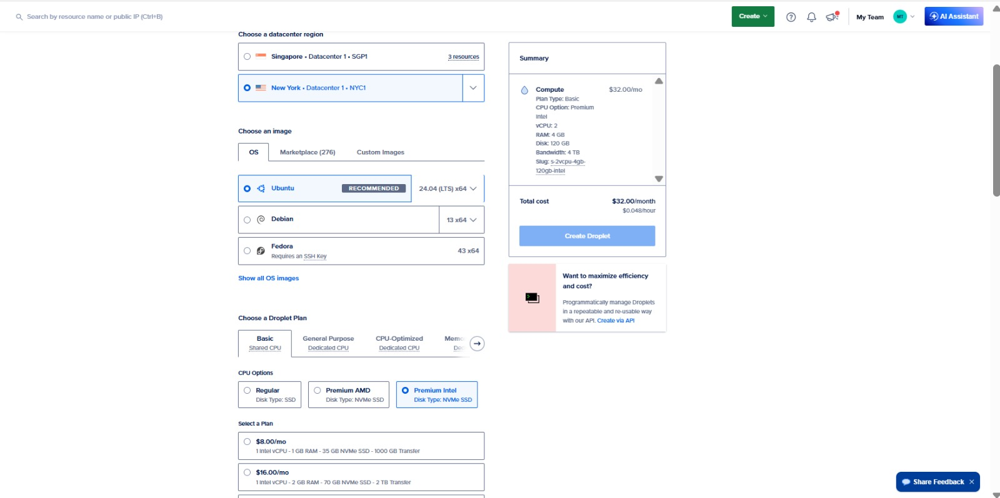
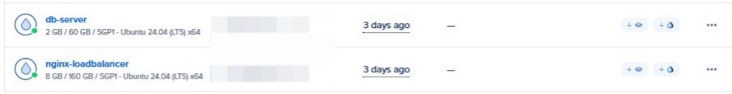

### 3.2 Konfigurasi Backend (Flask + MongoDB)


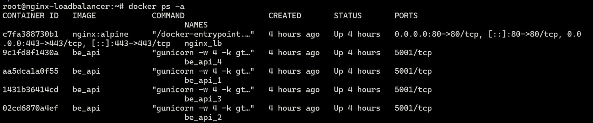

### 3.3 Konfigurasi Load Balancer / Reverse Proxy

> 
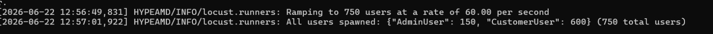

### 3.4 Deployment Frontend

Langkah 1: Login ke CloudFlare menggunakan akun email yang telah terdaftar, setelah itu pada halaman Account Home, pilih menu Workes & Pages. Lalu klik dibagian "+" yang terdapat pada bagian Workers and Pages.

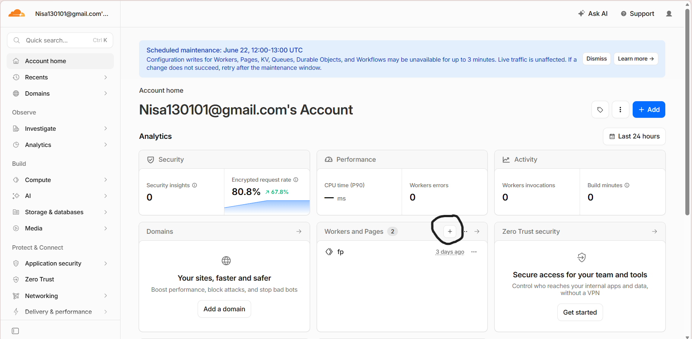

Langkah 2: 
Pilih opsi "Continue with Github" kemudian hubungkan repository GitHub yang berisi source code frontend.

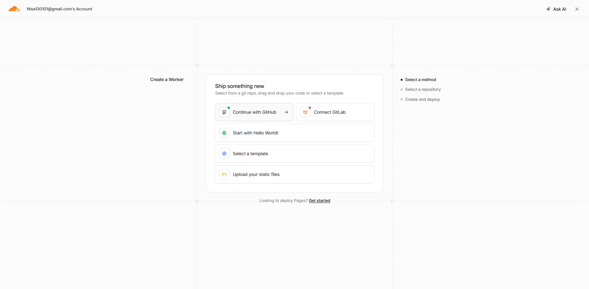

Lalu pilih repository proyek yang akan dideploy. Setelah itu mengisi opsi bagian git clone repository URL. Atau juga bisa memilih dari repository lalu pilih repository yang ada file frontendnya. Lalu Klik "Next"

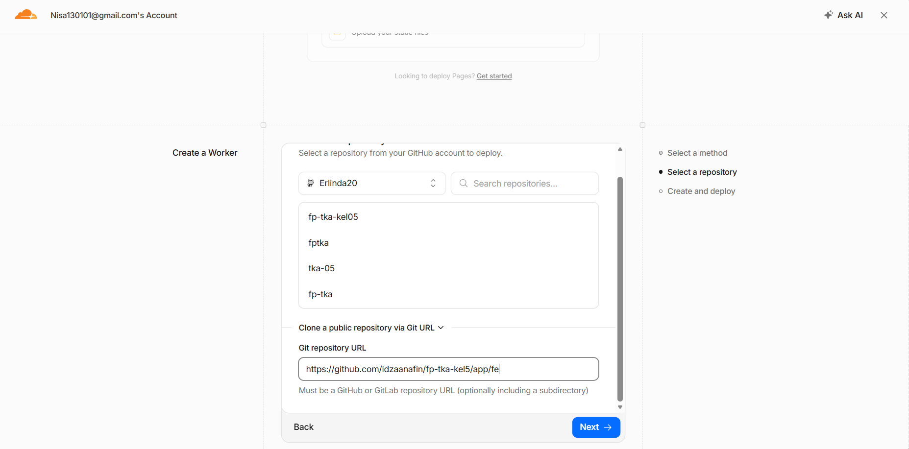

Setelah itu set up your application dengan memilih opsi git account yang digunakan, lalu memilih repository yang ada file Frontend. Lalu klik "deploy".

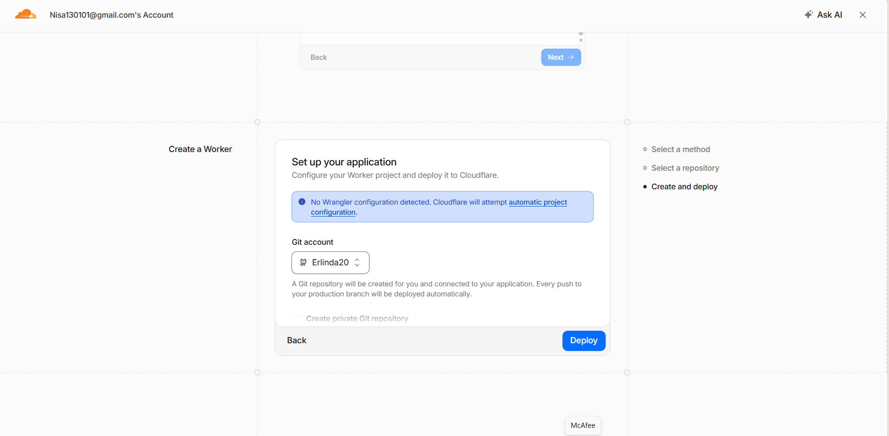

Langkah 3: Menunggu di build hingga selesai.

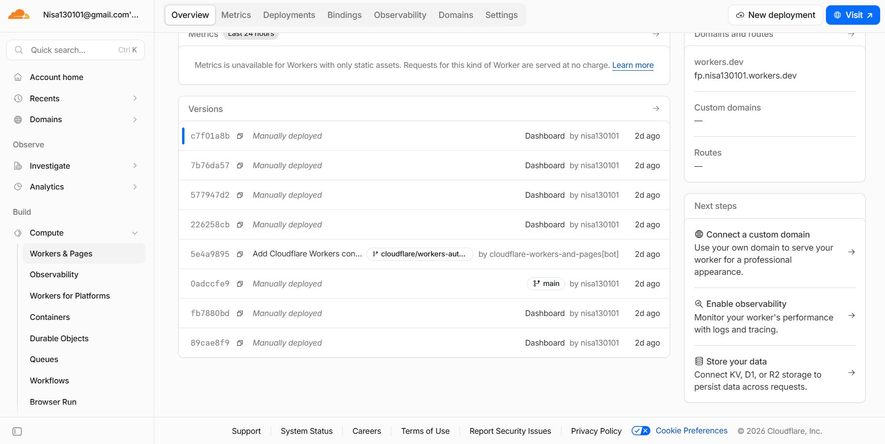

Langkah 4: Setelah sudah selesai otomatis akan muncul domainsnya yang siap digunakan untuk melihat frontendnya.

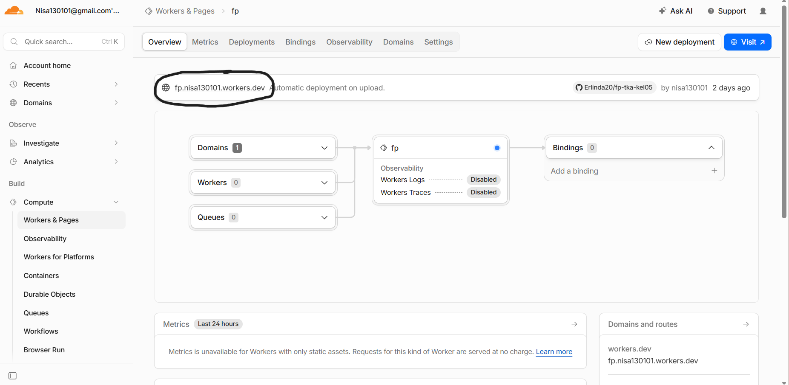

Langkah 5: lalu bisa paste hasil domainnya ke browser untuk mengakses aplikasi frontend.

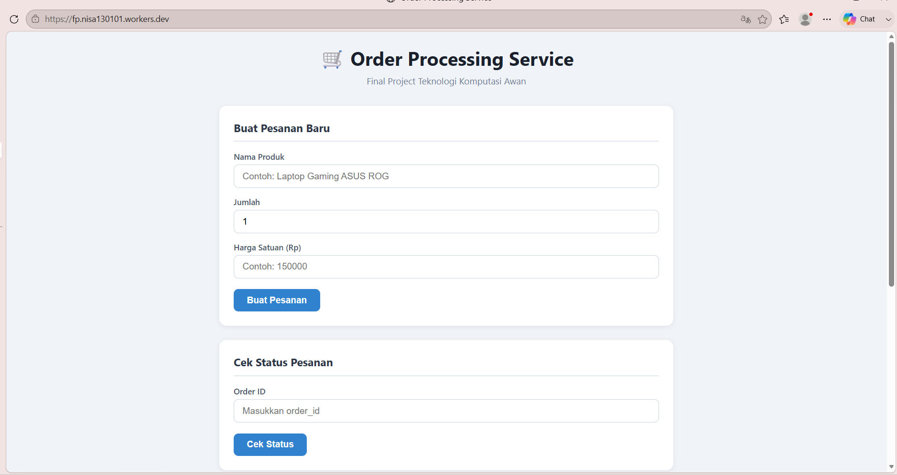


> _(Belum diisi — langkah deploy `index.html` dan `styles.css`, termasuk screenshot frontend yang sudah berjalan.)_

---

## 4. Pengujian Aplikasi

### 4.1 Pengujian Endpoint (Postman)

Pengujian endpoint POST /order menggunakan Postman untuk membuat pesanan baru. Request dikirim dalam format JSON yang berisi informasi produk, jumlah barang, dan harga satuan.
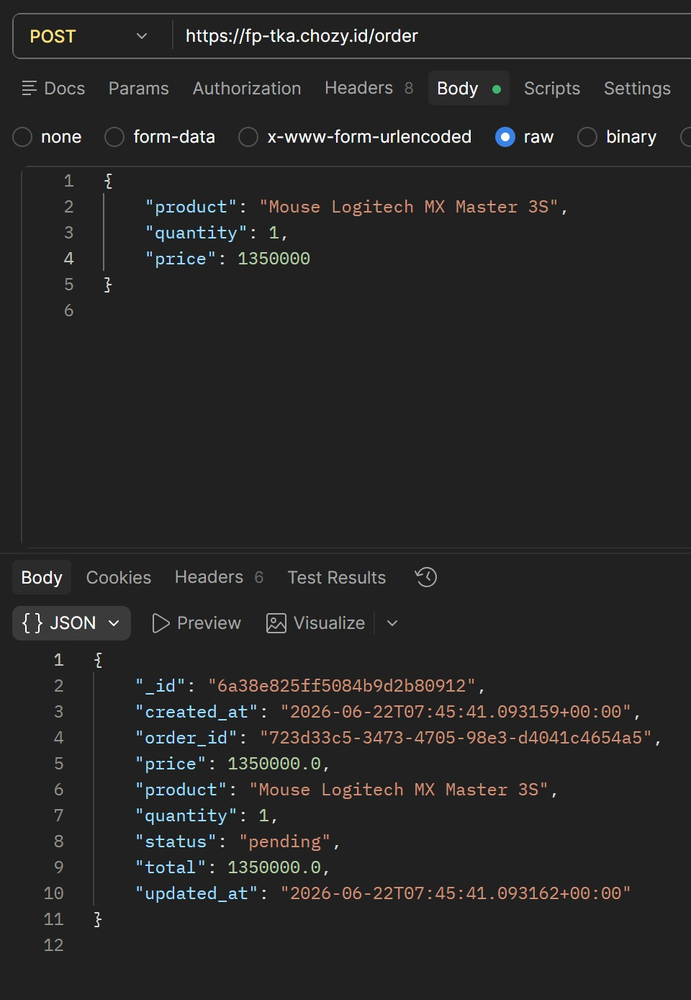

Pada pengujian ini, sistem berhasil mengembalikan data pesanan yang meliputi nama produk, harga, jumlah barang, total pembayaran, dan status pesanan. Status yang ditampilkan masih pending, yang menandakan pesanan telah dibuat namun belum diperbarui ke status berikutnya.

Hasil ini membuktikan bahwa layanan dapat melakukan pencarian dan pengambilan data pesanan secara akurat berdasarkan ID yang diberikan.

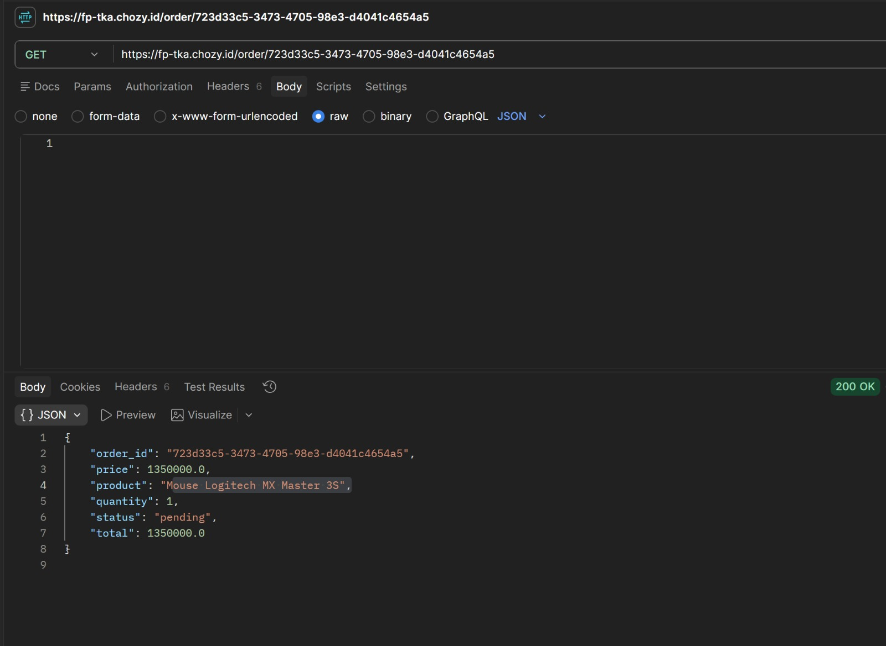

Respons yang diterima berupa array JSON yang berisi informasi lengkap setiap pesanan, seperti identitas pelanggan, daftar produk, metode pembayaran, status pembayaran, biaya pengiriman, subtotal, serta status pesanan. Endpoint ini berguna untuk kebutuhan monitoring, pelaporan, dan pengelolaan data pesanan secara keseluruhan.

Hasil pengujian menunjukkan bahwa sistem berhasil mengembalikan seluruh data pesanan dengan status respons 200 OK, menandakan endpoint berjalan dengan baik.

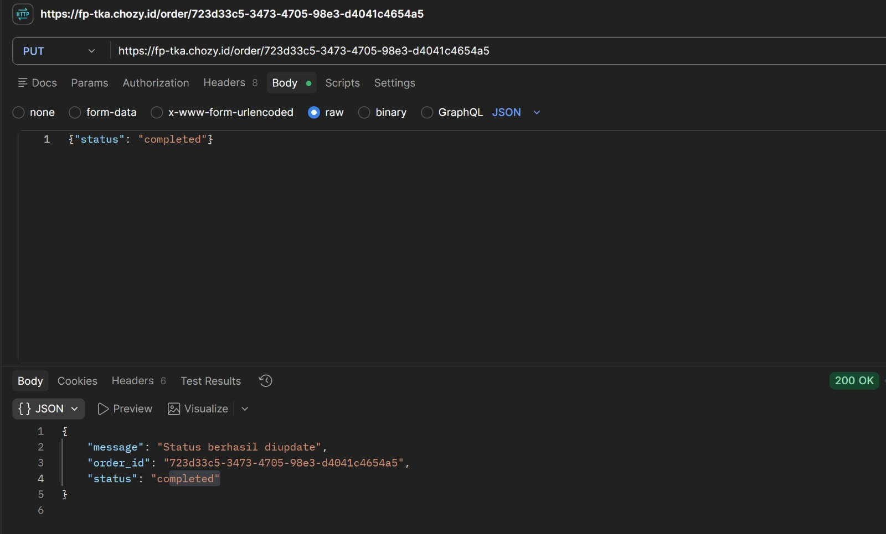

Setelah request diproses, server mengembalikan respons berupa pesan bahwa status pesanan berhasil diperbarui. Status baru yang tersimpan adalah completed, yang menunjukkan bahwa proses update data pada sistem berjalan dengan baik.

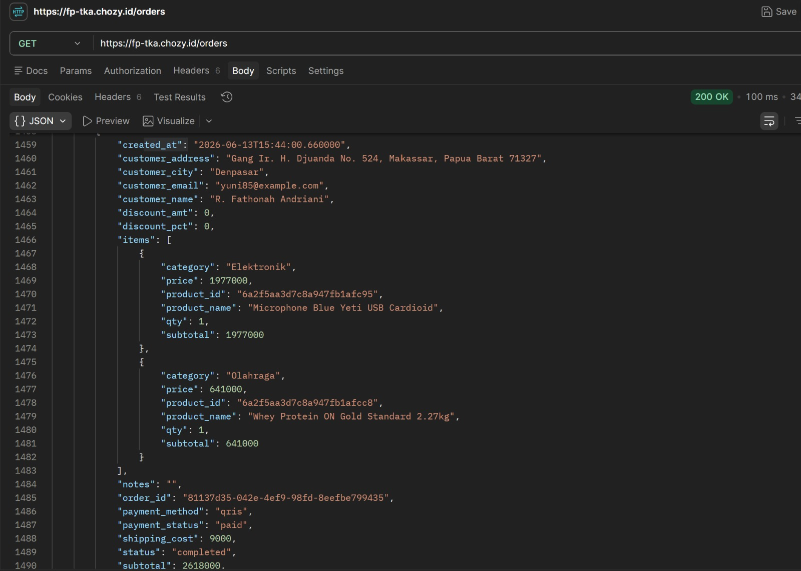

> _(Belum diisi — screenshot hasil request Postman untuk keempat endpoint: `POST /order`, `GET /order/<order_id>`, `GET /orders`, `PUT /order/<order_id>`.)_

### 4.2 Pengujian Antarmuka Frontend

Halaman ini digunakan untuk membuat pesanan baru pada sistem. Pengguna mengisi informasi berupa nama produk, jumlah barang, dan harga satuan. Setelah tombol Buat Pesanan ditekan, frontend mengirimkan request ke API Order Service untuk menyimpan data pesanan.

Pada gambar terlihat pesanan dengan produk Mouse Logitech MX Master 3S, jumlah 1 unit, dan harga Rp1.350.000 berhasil dibuat. Sistem kemudian menampilkan respons dari server berupa data pesanan yang berisi ID pesanan, informasi produk, total harga, serta status awal pesanan yaitu pending.

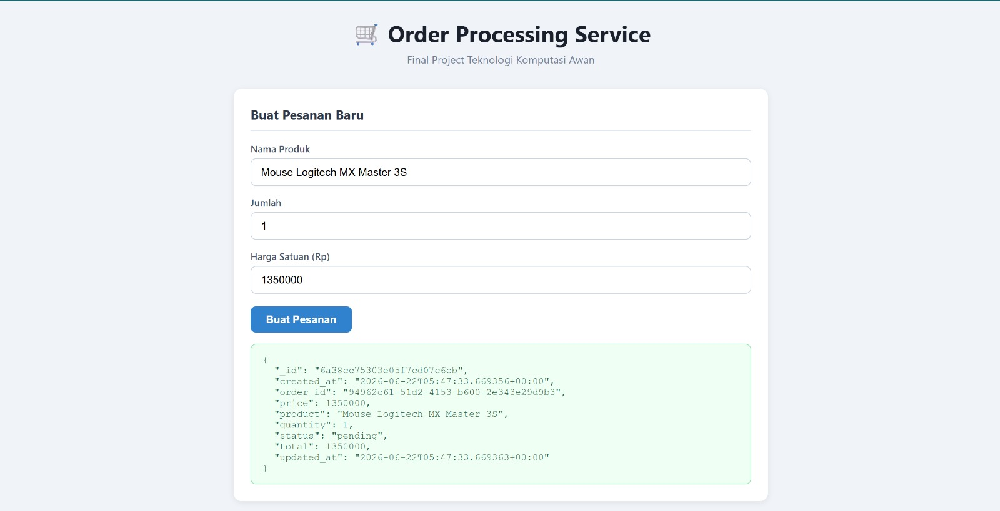

Untuk melihat ID Pesanannya yaitu: Inspect > Network > Response

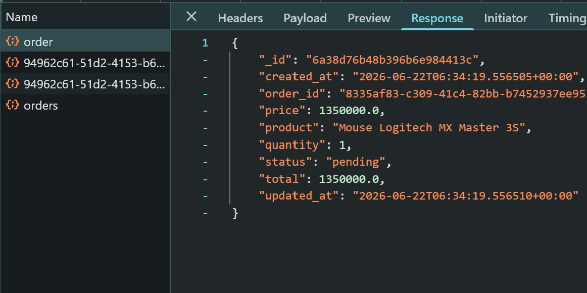

Fitur ini digunakan untuk melihat informasi dan status terkini dari suatu pesanan berdasarkan Order ID. Pengguna memasukkan ID pesanan yang telah dibuat sebelumnya kemudian menekan tombol Cek Status.

Sistem akan mengirimkan request ke backend dan menampilkan detail pesanan yang ditemukan. Pada gambar terlihat bahwa pesanan berhasil ditemukan dengan status completed, sehingga pengguna dapat mengetahui bahwa proses pesanan telah selesai diproses.

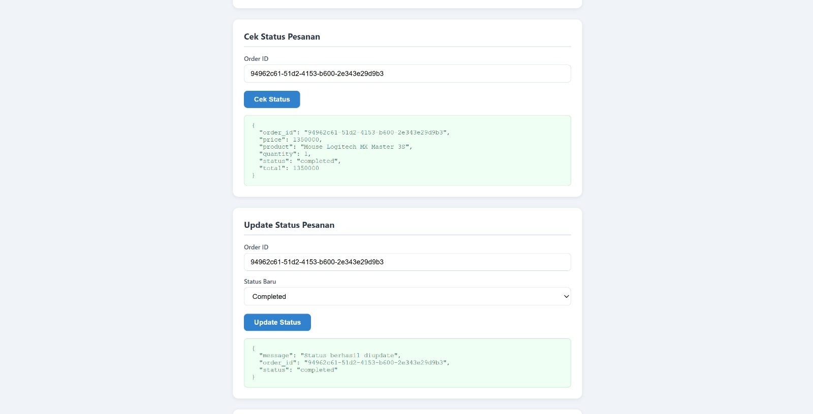

Halaman ini digunakan untuk mengubah status suatu pesanan. Pengguna memasukkan Order ID, memilih status baru dari daftar yang tersedia, kemudian menekan tombol Update Status.

Pada contoh pengujian, status pesanan diubah menjadi completed. Setelah proses berhasil, sistem menampilkan respons dari server berupa pesan konfirmasi bahwa status pesanan telah berhasil diperbarui beserta informasi ID pesanan yang diperbarui.


> _(Belum diisi — screenshot antarmuka frontend saat membuat pesanan, melihat status, dan menelusuri riwayat transaksi.)_

---

## 5. Load Testing

Pengujian dilakukan menggunakan **Locust** (`Resources/Test/locustfile.py`), dijalankan dari host yang berbeda dari server aplikasi. Database dibersihkan dari data hasil insert setiap skenario agar tidak terjadi akumulasi data.

### 5.1 Skenario Pengujian

| No | Skenario | Parameter | Durasi |
|----|----------|-----------|--------|
| 1 | Maksimum RPS (0% failure) | Naikkan user secara bertahap | 60 detik |
| 2 | Peak Concurrency — Spawn Rate 50 | Tingkatkan user hingga failure muncul, catat nilai sebelumnya | 60 detik |
| 3 | Peak Concurrency — Spawn Rate 100 | Sama seperti di atas | 60 detik |
| 4 | Peak Concurrency — Spawn Rate 200 | Sama seperti di atas | 60 detik |
| 5 | Peak Concurrency — Spawn Rate 500 | Sama seperti di atas | 60 detik |

### 5.2 Hasil Skenario 1 — Maksimum RPS

> user 750
Maksimum RPS yang bisa digunakan adalah 750
.jpeg)

Hasil menunjukkan rata-rata RPS yang didapat adalah 204.84

### 5.3 Hasil Skenario 2–5, Peak Concurrency

Berkut adalah hasil skenario yang dilakukan sesuai dengan skenario pengujian
| Skenario | Spawn Rate | Concurrent User Maksimum (failure 0%) |
|----------|-----------|----------------------------------------|
| 2 | 50 | 19.61 |
||
| 3 | 100 | 37.75 |
||
| 4 | 200 | 74.56 |
||
| 5 | 500 | 	139.44 |
||

### 5.4 Hasil Skenario dengan jumlah user 750


Hasil pengujian menunjukkan bahwa sistem berhasil memproses 12.341 request tanpa kegagalan (0% failure rate). Rata-rata waktu respons tercatat sebesar 886,29 ms dengan throughput mencapai 204,84 request per second (RPS). Hal ini menunjukkan bahwa sistem memiliki kemampuan yang baik dalam menangani beban tinggi.

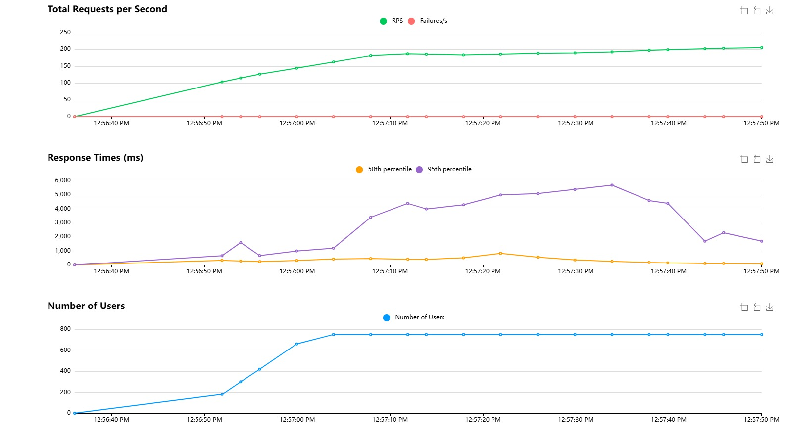


.png)


| No | Parameter | Hasil |
|----|-----------|--------|
| 1 | Total Requests | 12.341 |
| 2 | Failures | 0 |
| 3 | Average Response Time | 886,29 ms |
| 4 | Median Response Time | 29 ms |
| 5 | Maximum Response Time | 14.735 ms |
| 6 | Requests Per Second (RPS) | 204,84 |
| 7 | Failure Rate | 0% |

### 5.5 Monitoring Resource Utilization

> _Tampilan CPU & memory usage server selama pengujian_


---

## 6. Kesimpulan dan Saran

### 6.1 Kesimpulan

Berdasarkan rancangan arsitektur dan hasil pengujian load testing yang telah dilakukan, dapat disimpulkan bahwa:

1. Efisiensi Biaya (Cost-Effective): Pemilihan provider cloud Digital Ocean dengan arsitektur 2 VM—satu VM berukuran besar (4 vCPU, 8GB RAM) seharga $48/bulan untuk Load Balancer dan Backend, serta satu VM (2 vCPU, 2GB RAM) seharga $18/bulan untuk Database—telah berhasil memenuhi batasan budget maksimal $75/bulan. Total biaya arsitektur ini hanya $66/bulan (sekitar Rp 1.050.000), menyisakan ruang budget untuk kebutuhan lainnya.

2. Optimalisasi Latensi dan Resource: Penggabungan NGINX (Load Balancer) dan aplikasi Flask di satu node utama terbukti efektif memangkas latensi jaringan, karena komunikasi beralih melalui interface lokal (loopback). Selain itu, pemisahan VM untuk MongoDB memastikan tidak ada perebutan resource Input/Output (I/O) dan komputasi antara web server dan sistem database.

3. Stabilitas Saat Peak Load: Melalui hasil pengujian Locust, sistem ini memiliki kapasitas headroom komputasi yang tinggi dan secara handal dapat melayani request yang masif (hingga menyentuh ratusan concurrent users) dengan tingkat failure 0%, membuktikan sistem siap menghadapi kondisi ekstrim seperti flash sale.

### 6.2 Saran

Untuk pengembangan dan deployment skala produksi (nyata) di masa depan, disarankan melakukan beberapa peningkatan berikut:

1. Implementasi Auto-Scaling dan High Availability: Saat ini arsitektur masih bertumpu pada satu VM Backend besar (Single Point of Failure). Ke depannya, disarankan memisahkan Load Balancer ke layanan Managed Load Balancer mandiri dan menerapkan Auto-Scaling Group pada node Backend, sehingga server tambahan otomatis menyala hanya saat lonjakan traffic terjadi dan mati saat kondisi normal.

2. Penggunaan Caching Layer (Redis/Memcached): Mengimplementasikan sistem caching di dalam memori menggunakan Redis sangat direkomendasikan. Data dengan frekuensi akses tinggi seperti pengecekan status pesanan (GET Order Status) dapat dilayani melalui cache tanpa membebani MongoDB, sehingga response time lebih cepat.

3. Database Indexing dan Replikasi: Untuk mengoptimalkan kecepatan pencarian data di MongoDB saat antrean data makin besar, perlu dipastikan indexing diterapkan pada field-field yang sering dikueri (seperti order_id dan created_at). Pertimbangkan pula implementasi Replica Set untuk mencegah downtime apabila VM Database utama mengalami kendala.

4. Penerapan Monitoring & Alerting Terpusat: Agar operasional dan pengelolaan aplikasi lebih proaktif, gunakan alat monitoring dan alerting real-time seperti Prometheus dan Grafana untuk memantau utilitas CPU, RAM, serta throughput server secara terus menerus.

## Lampiran: Struktur Repository

```
fp-tka-[nama-kelompok]/
├── README.md               ← Laporan utama
├── Resources/
│   ├── BE/
│   │   └── app.py          ← Backend Flask
│   ├── FE/
│   │   ├── index.html
│   │   └── styles.css
│   └── Test/
│       └── locustfile.py   ← Script load testing
└── result/
    ├── locust_rps.png
    ├── locust_concurrency_*.png
    └── cpu_usage_*.png
```
